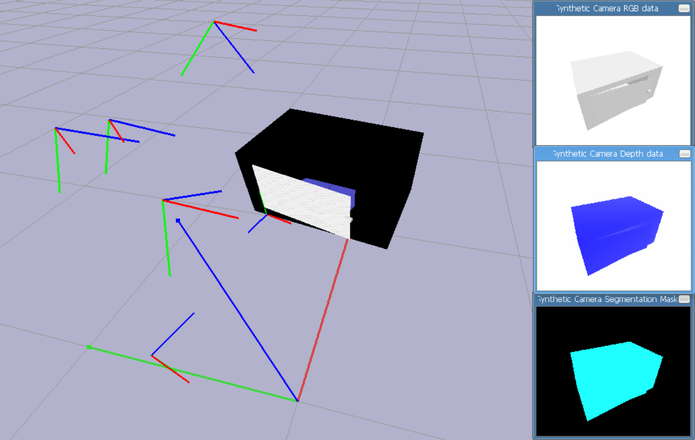
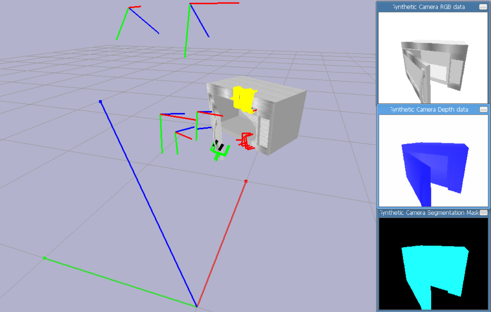
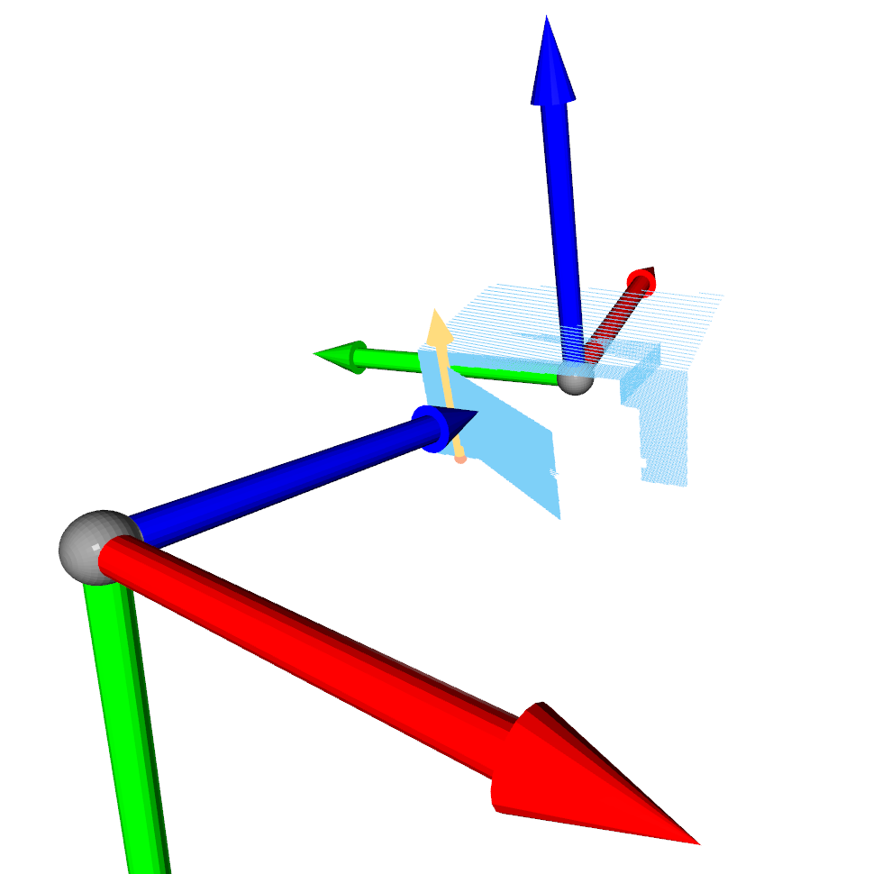
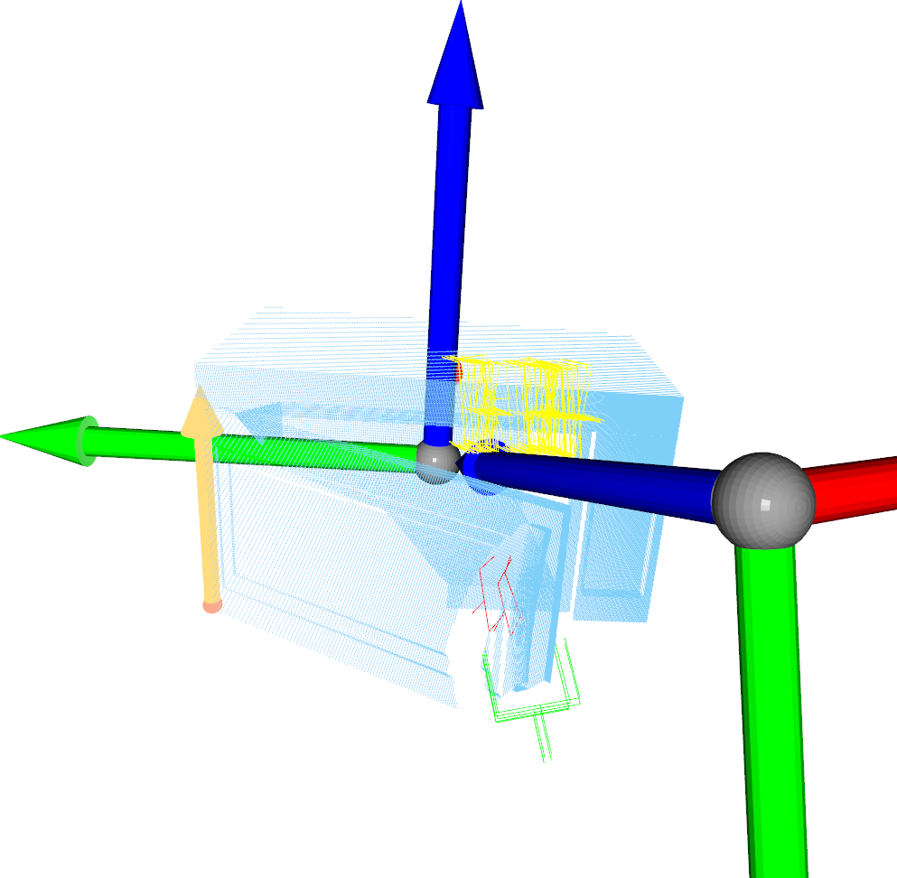

# articulation-generation
## Used datasets
* [**PartNet-Mobility**](https://sapien.ucsd.edu/browse)
  * **Microwave**: deprecated
  * **Microwave_v2**: deprecated
  * **Microwave_v3**: for joint pose estimation, with `7119`, `7128`, `7167`, `7221`, `7236`, `7263`, `7265` and `7296` as training dataset, `7304`, `7310`, `7349` and `7366` as testing dataset
  * **Microwave_v4**: for grasp affordance estimation, with `7119`, `7128`, `7167`, `7221`, `7236`, `7263`, `7265` and `7296` as training dataset, `7304`, `7310`, `7349` and `7366` as testing dataset
  * **Oven**: for joint pose estimation, with `101773`, `101909`, `101917`, `101943` and `101946` as training dataset, `102018` and `102019` as testing dataset
  * **Oven_v2**: for grasp affordance estimation, with `101909`, `101917`, `101943` and `101946` as training dataset, `102018` and `102019` as testing dataset
  * **Box**: for joint pose estimation, with `100154`, `100162`, `100658`, `100676` and `102373` as training dataset, `100197`, `100202` and `100224` as testing dataset
  * **Box_v2**: for grasp affordance estimation, with `100154`, `100162`, `100658`, `100676` and `102373` as training dataset, `100197`, `100202` and `100224` as testing dataset
  * **Drawer**: for joint pose estimation, with `20411`, `23511`, `24931`, `26806` and `28668` as training dataset, `24644` and `26503` as testing dataset
  * **Drawer_v2**: for grasp affordance estimation, with `20411`, `23511`, `24931`, `26806` and `28668` as training dataset, `24644` and `26503` as testing dataset
* **L515**
  * 1 real microwave instance with 15 random camera poses and joint states captured by RealSense L515.
  * Also provide manually annotated joint poses, manually labelled grasp affordances, under-table-removed point clouds and RGB images.

Drop me email if you want to obtain the datasets.

## Install
1. Create a conda virtual environment.
   ```bash
   conda create -n articulation python=3.9
   conda activate articulation
   ```

2. Install [PyTorch](https://pytorch.org/).
   ```bash
   pip install torch torchvision torchaudio --extra-index-url https://download.pytorch.org/whl/cu113
   ```

3. Install other dependencies.
   ```bash
   pip install -r requirements.txt
   ```

4. Install [AnyGrasp](https://github.com/graspnet/anygrasp_sdk) following its instruction. Choose correct library sdk `gsnet.so` and `lib_cxx.so` according to your python version (here should be 3.9) and put them in this root directory. Also put the license in this root directory. And the checkpoint path can be set in the configuration as `gsnet_weight` item.

## Get Started
```bash
# prepare your data in `datasets`

# prepare your config in `configs`

# run
python collect_data.py --config configs/*.txt

# visualize
python visualize_data.py --data_path $log_path/$object/$id/*/*.npz

# analyse dataset
python analyse_data.py --dataset_path $log_path/$object --grasp $whether_grasp

# real L515 camera get data
python l515_get_data.py

# remove table from real data
python real_remove_table.py --image_path $image_path --pc_path $pc_path --marker_width $num_w --marker_height $num_h --marker_size $marker_size --table_color $table_color

# calibrate joint manually on real data
python calibrate_joint.py --pc_path $pc_path --translation $translation --rotation $rotation

# add anygrasp detected grasps to real data
python add_grasp.py --data_path $data_path --gsnet_weight $gsnet_weight

# label affordance manually on real data
python label_affordance.py --pc_path $pc_path
```

## Logic
For one run, we will collect the data of one instance (specified by `id` and `object_path`) of specific object category (specified by `object` and `object_path`). We will randomly choose its own pose and its joints' states with `num_samples` times. For each sample, we will also randomly choose the corresponding `auto_camera` camera poses to render and collect. The collected point cloud, object pose and joint poses are also transformed into the corresponding camera coordinate. Optionally, if set `grasp`, we will also collect grasp affordance. Specifically, for each sample each camera, we will run anygrasp's grasp detection on the collected point cloud in camera coordinate, and select the best 100 grasps and remove those with width exceeding the permitted range. Then we will test for each joint, that whether this grasp can first reach that pose without contacting object. If not so, we think this pose is not valid or secure so that mark its affordance as `-1`. But if it can reach, then we will further test whether this grasp can successfully move so that the joint can be changed enough. More specifically, we will test the success for both orientations, for example, pull and push, clock-wise and counter-clock-wise. If it can succeed in both orientations, we mark its affordance as `2`; if it can succeed in only one orientation, we mark as `1`; and if it succeed none, we mark as `0`. The collected grasp will contain its predicted score, width, height, depth, translation vector and rotation matrix in camera coordinate, together with tested joint index and the affordance. Further more, if set `allow`, we will automatically make tiny move on the detected grasp pose to adapt it to grasp more easily, since original anygrasp is targeted at small objects, but the collected grasps are still recorded as original grasps detected by anygrasp. If set `contact`, we will use contact points detection to check success instead of really manipulating. If set `direct`, we will directly set gripper pose to the grasp pose instead of approaching.




For real data table-remove, we will first detect chessboard marker by opencv and use it to calibrate camera to get camera-to-marker transformation matrix, and then remove $z>0$ point cloud in marker coordinate. Optionally we also provide remove according similar color by setting `table_color`.

## Note
* You need first visualize to see the appropriate auto camera cone.
* You need also first visualize to choose the correct joint `link_id`, `link_type` and `link_axis`, also if the translation for the joint is not what you want, you can tune the `link_offset` and record in `link_pos`.
* Currently support multiple joints.

## Generated dataset
structure example:
```txt
dataset
|- Microwave (per category)
   |- 7119 (per instance)
      |- 0000 (per state)
         |- 0000.npz (per camera)
            |- object_pose (4x4) (transformation matrix in camera coordinate)
            |- joint_pose (Jx4x4) (transformation matrix in camera coordinate, position and axis can be known from config.json)
            |- point_cloud (Nx3) (visible points' coordinates in camera coordinate)
            |- grasp (Gx8) (score, width, height, depth, 3 translation, 3x3 rotation, joint index, affordance)
         |- ...
         |- config.json
```

The example code to load the data can refer to `visualize_data.py`.



* `Microwave_v3` has 1600 + 800 = 2400 data samples, with 1 revolute joint.
* `Microwave_v4` has 1099 + 481 = 1580 point clouds, 27012 + 18963 + 11790 + 14468 = 72233 and 11180 + 9426 + 5899 + 6371 = 32876 data samples, with 1 revolute joint.
* `Oven` has 1000 + 400 = 1400 data samples, with 1 revolute joint.
* `Oven_v2` has 618 + 297 = 915 point clouds, 11493 + 8794 + 17764 + 6387 = 44438 and 5315 + 6475 + 2997 + 4641 = 19428 data samples, with 1 revolute joint.
* `Box` has 1000 + 600 = 1600 data samples, with 4 revolute joints.
* `Box_v2` has 690 + 456 = 1146 point clouds, 36318 + 88302 + 721 + 14814 = 140155 and 25209 + 67570 + 806 + 10661 = 104246 data samples, with 4 revolute joints.
* `Drawer` has 1000 + 400 = 1400 data samples, with 1 prismatic joint.
* `Drawer_v2` has 654 + 265 = 919 point clouds, 5845 + 14148 + 8103 + 20586 = 48682 and 2187 + 4208 + 1713 + 3257 = 11365 data samples, with 1 prismatic joint.
* `L515/with` has 15 data samples, with 1 revolute joint, with table noisy points.
* `L515/without` has 15 data samples, with 1 revolute joint, without table noisy points.
* `L515/without_grasp` has 15 point clouds, 250 + 215 + 733 + 301 = 1499 data samples, with 1 revolute joint, without table noisy points.

Drop me email if you want to obtain the datasets.
